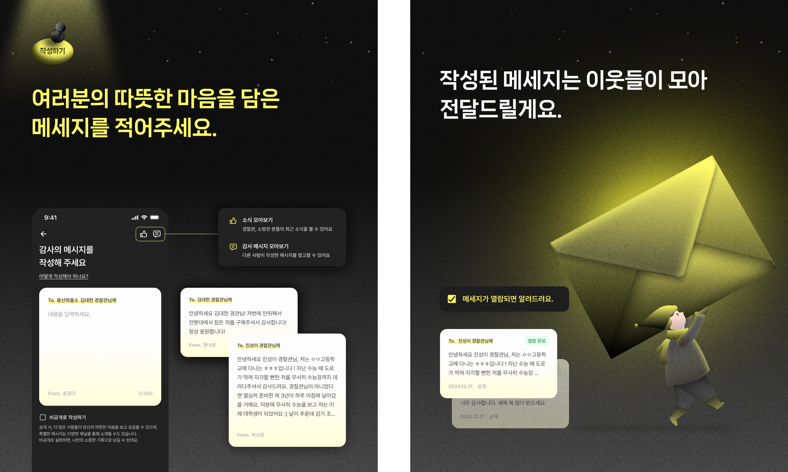
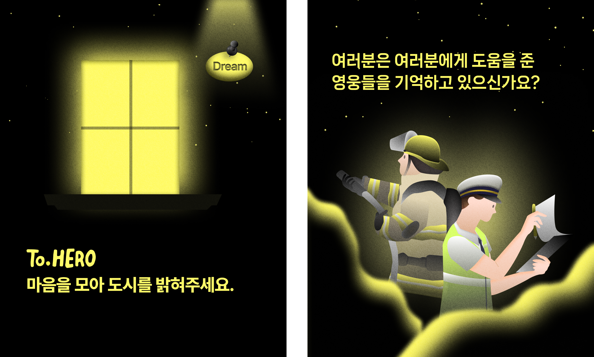

# 💌 To. HERO

  

> To. HERO - 경찰관, 소방관들에게 감사 인사를 전달하는 편지 서비스  
> 개발 기간 : 2024.12 ~ 2025.01  
> 배포 주소 : https://tohero.co.kr

 

## ✅ 프로젝트 소개

 

## ✅ 멤버 구성

- 기획 2명
- 디자인 1명
- 프론트엔드 1명
- 백엔드 1명

 

## ✅ 기술 스택

### Environment

&nbsp;

&nbsp;

### Config

### Development

&nbsp;

&nbsp;

&nbsp;

&nbsp;

&nbsp;

### Communication & Docs

&nbsp;

 

## ✅ 주요 기능

### ✨ 로그인 및 닉네임 등록

- 카카오 로그인과 비로그인을 선택할 수 있습니다.
- 처음 로그인을 하거나 비로그인을 선택한 경우, 닉네임 등록을 진행합니다.
- 이전에 카카오 로그인을 했었다면, 바로 홈 화면으로 이동합니다.

### ✨ 경찰관, 소방관을 위한 편지 조회

- 투히어로를 통해 사람들이 작성한 편지를 확인할 수 있습니다.
- 모바일 특성을 고려해 무한 스크롤로 편지 내용을 추가적으로 조회할 수 있습니다.
- 누적 편지 개수에 따라 홈 화면에 보이는 이미지가 점점 밝아집니다.

### ✨ 경찰관, 소방관을 위한 편지 작성

- 경찰관, 소방관께 드릴 편지를 작성할 수 있습니다.
- 특정 경찰서 혹은 소방서, 특정 경찰관 혹은 소방관에게 전달드릴 수 있습니다.
- 경찰서와 소방서는 키워드로 검색할 수 있습니다.
- 편지 작성에 도움이 될 수 있도록 다른 사람들이 작성한 편지를 조회할 수 있습니다.
- 경찰관, 소방관분들의 최근 소식을 확인할 수 있습니다.
- 편지가 실제로 전달되면 알림을 받을 수 있도록 푸시 알림 받기 여부를 선택할 수 있습니다.

추가 작성 예정.

 

 

## ✅ 화면 구성

작성 예정
